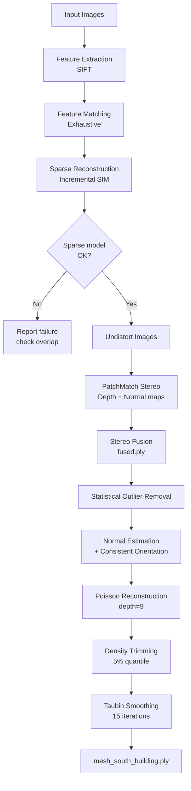
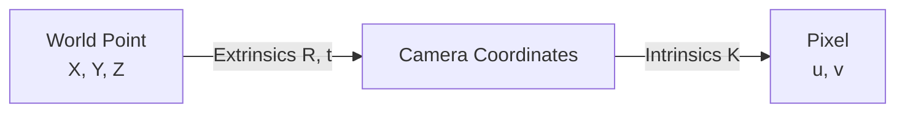
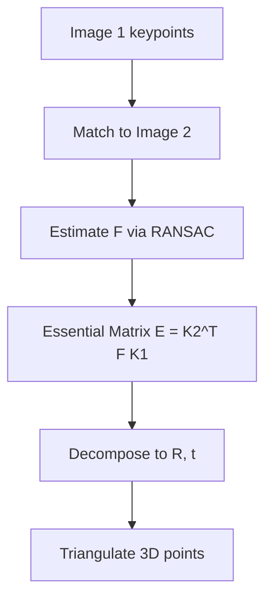
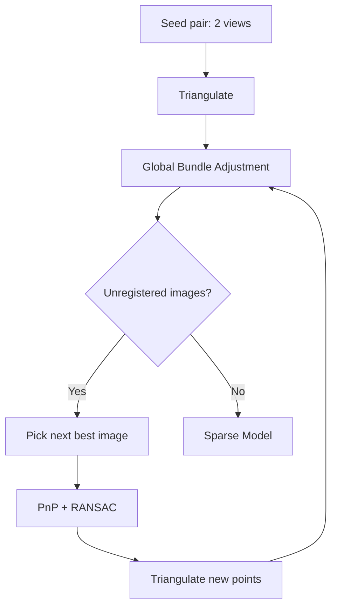
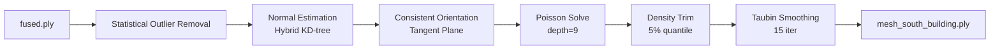

# South Building — 3D Reconstruction with PyCOLMAP + Open3D

An end-to-end photogrammetry pipeline that reconstructs a dense 3D point cloud and a triangle mesh from a set of overlapping images. Built on a **custom PyCOLMAP** compiled from source with **CUDA** support, and **Open3D** for surface reconstruction.

Tested on the **South Building** dataset (COLMAP demo data).

---

## Features

- **GPU-accelerated** feature extraction and matching (CUDA), with a CPU fallback via `--device`.
- **Incremental Structure-from-Motion (SfM)** with PyCOLMAP.
- **Multi-View Stereo (MVS)** dense reconstruction via PatchMatch.
- **Poisson surface reconstruction** with density trimming and Taubin smoothing in Open3D.
- Reproducible environment via [uv](https://docs.astral.sh/uv/).
- Documented workarounds for common Linux library conflicts (Intel MKL / OpenBLAS).

---

## Pipeline Overview



---

## Repository Structure

```
.
├── reconstruction.py           # SfM + MVS pipeline (PyCOLMAP)
├── mesh_generation.py          # fused.ply -> mesh (Open3D)
├── pyproject.toml              # uv project config
├── data/
│   ├── south-building/
│   │   └── images/             # input images
│   └── workspace/              # all reconstruction outputs
├── .gitignore
└── README.md
```

> The `data/` directory is **not** committed to git. See `.gitignore`.

---

## Requirements

- Python 3.10+
- [uv](https://docs.astral.sh/uv/) (recommended) or pip
- A **custom PyCOLMAP build** compiled from source **with CUDA** (for GPU mode)
- NVIDIA GPU + recent drivers (for GPU mode)
- Linux (tested on Ubuntu). macOS/Windows may work but are untested.

> **Note:** The `pycolmap` wheels on PyPI do **not** include CUDA. To use GPU mode you must build COLMAP and PyCOLMAP from source. See the [COLMAP install guide](https://colmap.github.io/install.html).

---

## Installation

### 1. Clone

```bash
git clone https://github.com/<your-username>/<your-repo>.git
cd <your-repo>
```

### 2. Create the uv environment

```bash
uv venv
source .venv/bin/activate
```

### 3. Install dependencies

**If you built PyCOLMAP from source (recommended for GPU):**

```bash
uv pip install -e /path/to/colmap/pycolmap
uv pip install open3d numpy
```

**If you only need CPU (PyPI pycolmap):**

```bash
uv pip install pycolmap open3d numpy
```

### 4. Download the dataset

Grab the South Building dataset from the [COLMAP datasets page](https://demuc.de/colmap/datasets/) and place the images under:

```
data/south-building/images/
```

---

## Usage

### Step 1 — Reconstruction

```bash
# GPU (default)
uv run python3 reconstruction.py

# CPU fallback
uv run python3 reconstruction.py --device cpu

# If uv warns about VIRTUAL_ENV mismatch
uv run --active python3 reconstruction.py
```

Outputs are written to `data/workspace/`:

| Path | Description |
|---|---|
| `data/workspace/database.db` | COLMAP feature/match database |
| `data/workspace/*.bin` | Sparse model (cameras, images, points3D) |
| `data/workspace/mvs/` | Dense workspace (depth + normal maps) |
| `data/workspace/mvs/fused.ply` | Fused dense point cloud |

> ⚠️ **Re-running `reconstruction.py` on the same `data/workspace` will overwrite** the sparse model, depth maps, normal maps, and `fused.ply`. Back up first:
> ```bash
> cp -a data/workspace data/workspace-backup
> ```

### Step 2 — Mesh Generation

```bash
uv run python3 mesh_generation.py
```

Output: `data/workspace/mvs/mesh_south_building.ply`

The meshing script:

1. Loads `fused.ply`
2. Removes statistical outliers (`nb_neighbors=20`, `std_ratio=2.0`)
3. Estimates normals with a hybrid KD-tree search (`radius=0.1`, `max_nn=30`)
4. Orients normals consistently via tangent plane propagation
5. Runs Poisson reconstruction (`depth=9`, `scale=1.1`, `linear_fit=True`)
6. Trims low-density vertices (5% quantile)
7. Applies Taubin smoothing (15 iterations) to reduce noise without shrinkage
8. Writes a binary PLY

**Before running, verify the paths at the top of `mesh_generation.py` match your workspace:**

```python
input_file  = "data/workspace/mvs/fused.ply"
output_file = "data/workspace/mvs/mesh_south_building.ply"
```

---

## Theory: Multi-View Geometry in This Pipeline

This project is a practical implementation of classical multi-view geometry. Below is what each stage actually computes.

### 1. Pinhole Camera Model

Each image is modeled as a projection of 3D world points through a camera matrix:

$$
\begin{bmatrix} u \\ v \\ 1 \end{bmatrix}
\sim
K \, [R \mid t]
\begin{bmatrix} X \\ Y \\ Z \\ 1 \end{bmatrix}
$$

where $K$ holds the intrinsics (focal length, principal point) and $[R \mid t]$ is the camera's pose in world coordinates.



### 2. Feature Extraction (SIFT)

Scale-invariant keypoints are detected per image and described by 128-dim SIFT descriptors. Each keypoint is a candidate correspondence across views.

### 3. Feature Matching

Descriptors are matched between image pairs (exhaustive in our case). A match is a pair $(\mathbf{x}_i, \mathbf{x}_j)$ believed to be the same physical point.

### 4. Epipolar Geometry & Two-View Initialization

For a pair of images, the fundamental matrix $F$ satisfies:

$$
\mathbf{x}_j^\top F \, \mathbf{x}_i = 0
$$



Triangulation solves for the 3D point $\mathbf{X}$ that projects to both $\mathbf{x}_i$ and $\mathbf{x}_j$ (DLT or midpoint minimization).

### 5. Incremental SfM

New images are registered one at a time via 2D–3D correspondences (PnP + RANSAC), then all poses and points are refined jointly.



### 6. Bundle Adjustment

Non-linear least squares over reprojection error:

$$
\min_{\{R_i, t_i\}, \{X_k\}} \sum_{i,k} \rho \left( \left\| \pi(K_i, R_i, t_i, X_k) - \mathbf{x}_{ik} \right\|^2 \right)
$$

Solved with **Levenberg–Marquardt** in Ceres Solver. This is the step that pulls in **BLAS/LAPACK** (hence the Intel MKL / OpenBLAS sensitivity).

### 7. Multi-View Stereo (PatchMatch)

With known poses, per-pixel depth and normals are estimated by matching patches across multiple views, producing dense depth and normal maps.

### 8. Stereo Fusion

Depth maps are fused into a single consistent point cloud (`fused.ply`), rejecting outliers via photometric and geometric consistency checks.

### 9. Surface Reconstruction (Poisson)

Given a point cloud with oriented normals, Poisson reconstruction solves for an indicator function $\chi$ whose gradient matches the vector field $\mathbf{V}$ defined by the normals:

$$
\Delta \chi = \nabla \cdot \mathbf{V}
$$

The isosurface is extracted via marching cubes, producing a smooth, watertight mesh. Our script:



- **Statistical outlier removal** drops points farther than `std_ratio × σ` from the mean distance to their `nb_neighbors` neighbors.
- **Normal orientation** propagates a consistent tangent plane so normals point outward (required for Poisson).
- **Poisson depth = 9** controls the octree resolution — higher is finer but memory-hungry. Depth 8–10 is the practical range.
- **Density trimming** removes low-confidence vertices at the mesh boundary (5% quantile).
- **Taubin smoothing** is a non-shrinking low-pass filter — unlike Laplacian smoothing, it alternates positive and negative steps to preserve volume.

---

## Troubleshooting

### `Intel MKL FATAL ERROR: Cannot load libmkl_avx2.so`

**Symptom**

```
INTEL MKL ERROR: .../libmkl_avx2.so: undefined symbol: mkl_sparse_optimize_bsr_trsm_i8
Intel MKL FATAL ERROR: Cannot load libmkl_avx2.so or libmkl_def.so.
```

**Cause:** A mismatch between MKL libraries on your system. Bundle adjustment (Ceres) triggers it when it loads BLAS/LAPACK.

**Fix — permanent (recommended):** Preload the correct MKL core libraries in your shell config.

Find where MKL lives:

```bash
find /usr /lib -name "libmkl_core.so*" 2>/dev/null
```

Add this to `~/.bashrc` (adjust the path if yours differs):

```bash
export LD_PRELOAD=/usr/lib/x86_64-linux-gnu/libmkl_core.so:/usr/lib/x86_64-linux-gnu/libmkl_sequential.so
```

Reload:

```bash
source ~/.bashrc
```

This forces the correct load order so the missing symbol is always resolved.

### Use OpenBLAS instead of Intel MKL

If MKL keeps breaking, swap it for OpenBLAS. Slightly slower for BLAS-heavy work but far more reproducible.

**On Debian/Ubuntu:**

```bash
sudo apt install libopenblas-dev
```

**For the Python scientific stack via pip/uv:**

```bash
uv pip uninstall mkl mkl-service
uv pip install --force-reinstall numpy
```

**If you keep MKL, force a compatible threading layer:**

```bash
echo 'export MKL_THREADING_LAYER=GNU' >> ~/.bashrc
source ~/.bashrc
```

### uv: `VIRTUAL_ENV does not match the project environment`

```
warning: `VIRTUAL_ENV=.venv` does not match the project environment path `/home/user/.venv`
```

**Fix:** Use `--active`:

```bash
uv run --active python3 reconstruction.py
```

Or pin it in `pyproject.toml`:

```toml
[tool.uv]
project-environment = ".venv"
```

### CUDA out of memory

Lower `max_image_size` in `reconstruction.py`:

```python
extraction_options.max_image_size = 640   # was 1024
```

and in the fusion options:

```python
fusion_options.max_image_size = 640
```

For very large scenes, also reduce Poisson `depth` in `mesh_generation.py` (8 instead of 9).

### `pycolmap.Device.cuda` AttributeError

```bash
python -c "import pycolmap; print(pycolmap.Device.__members__)"
```

Some builds use `Device.CUDA` (uppercase) or integer enums. Adjust accordingly.

### `ERROR: Cannot find 'fused.ply'`

Check the `input_file` path at the top of `mesh_generation.py`. It must match the output of `reconstruction.py`:

```python
input_file  = "data/workspace/mvs/fused.ply"
```

If your reconstruction writes to a different directory, edit this path.

### Open3D Poisson mesh looks "blobby" or over-smoothed

- Lower `depth` (8 instead of 9) to preserve detail.
- Increase `density_threshold` quantile (e.g. `0.10`) to trim more.
- Reduce Taubin iterations (e.g. 5–10).
- Ensure normals are consistently oriented (the `orient_normals_consistent_tangent_plane(100)` call is important).

---

## Notes on Reproducibility

- The dense MVS stage **always uses GPU** if COLMAP was built with CUDA — it does not honor `--device cpu`. For a fully CPU pipeline, use a CPU-only COLMAP build or skip the dense stage.
- Full reconstruction on South Building can take **hours**. To iterate quickly, test on a subset:

  ```bash
  mkdir -p data/south-building-test/images
  ls data/south-building/images/* | head -20 | xargs -I{} cp {} data/south-building-test/images/
  ```

  Then point `root_dir` in `reconstruction.py` at the test folder.

---

## Acknowledgements

- [COLMAP](https://colmap.github.io/) — Schönberger & Frahm, *Structure-from-Motion Revisited*, CVPR 2016.
- [PyCOLMAP](https://github.com/colmap/pycolmap)
- [Open3D](http://www.open3d.org/)
- South Building dataset from the COLMAP demo data.
